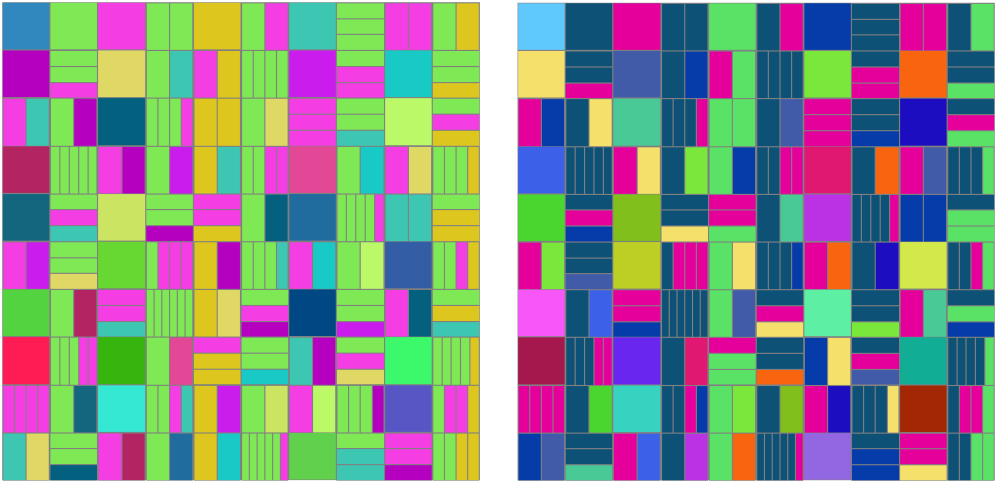

# Prime-Fact-Chart

This project displays the first 100 numbers - as square boxes; from the top left to bottom right, like you would read lines in a book. 

## Random Colours - How to

- [Source](https://www.npmjs.com/package/randomcolor)  
- [Documentation](https://randomcolor.lllllllllllllllll.com/)

*TRULY RAN­DOM COL­ORS*  
`randomColor({hue: 'random', luminosity: 'random', count: 27});`

*DARK COL­ORS*  
`randomColor({luminosity: 'dark', count: 27});`

*LIGHT COL­ORS*  
`randomColor({luminosity: 'light',count: 27});`

*BRIGHT COL­ORS*  
`randomColor({luminosity: 'bright',count: 27});`

*Green hue*  
`randomColor({hue: 'green', count: 27});`